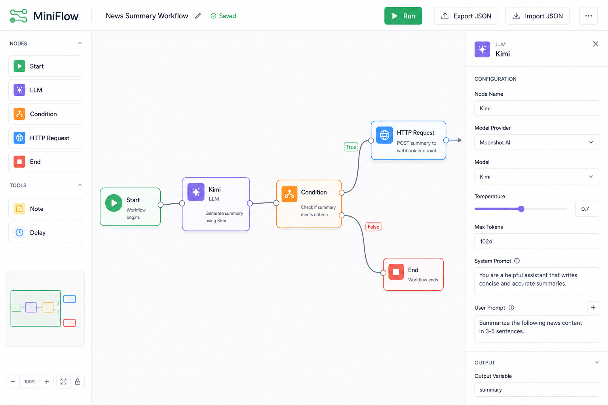
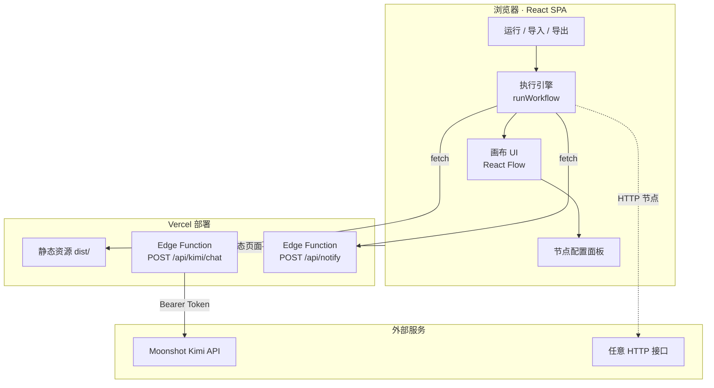
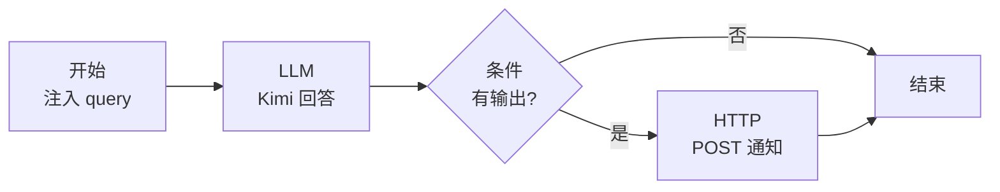

# MiniFlow

<p align="center">
  <strong>轻量级可视化工作流编辑器</strong><br />
  拖拽编排 · Kimi 大模型 · 条件分支 · 一键运行 · JSON 持久化
</p>

<p align="center">
  <a href="https://mini-flow-zeta.vercel.app"></a>
  <a href="https://github.com/924950698/MiniFlow"></a>
  
  
  
</p>

<p align="center">
  <a href="https://mini-flow-zeta.vercel.app">
    
  </a>
</p>

<p align="center">
  <sub>点击图片访问在线 Demo · 录屏 GIF 可替换为 <code>docs/demo.gif</code></sub>
</p>

---

## 产品简介

MiniFlow 是一个面向开发者与 AI 应用搭建者的**浏览器端工作流编辑器**。你可以在画布上自由组合「开始 → LLM → 条件 → HTTP → 结束」等节点，配置参数后一键运行整条链路，并查看每个节点的输入与输出。

适用于快速验证 Prompt 链路、搭建轻量 Agent 原型、演示 AI 工作流编排等场景。

### 核心能力

| 能力 | 说明 |
|------|------|
| 可视化编排 | 基于 React Flow 的拖拽画布，五种节点类型自由连线 |
| 链路执行 | 按拓扑顺序运行，支持 `{{nodeId.field}}` 变量引用 |
| Kimi 集成 | 通过服务端代理调用 Moonshot API，密钥不暴露到前端 |
| 条件分支 | JavaScript 表达式判断，走「是 / 否」不同路径 |
| 持久化 | 导出 / 导入 JSON，浏览器自动保存草稿 |

---

## 在线 Demo

**[https://mini-flow-zeta.vercel.app](https://mini-flow-zeta.vercel.app)**

> LLM 节点需在 Vercel 配置 `MOONSHOT_API_KEY` 后方可正常调用，见下方部署说明。

---

## 架构设计



### 默认工作流示例



### 目录结构

```
MiniFlow/
├── src/
│   ├── components/      # 工具栏、配置面板、节点创建器
│   ├── engine/          # 图遍历、变量解析、节点执行器
│   ├── nodes/           # 五种自定义节点
│   ├── workflow/        # JSON 序列化 / 反序列化
│   └── services/        # Kimi 客户端
├── api/                 # Vercel Edge Functions（生产 API）
├── docs/                # 产品截图 / Demo GIF
└── vite-plugin-kimi-api.ts  # 本地开发 API 中间件
```

---

## 技术栈

| 层级 | 技术 | 用途 |
|------|------|------|
| 前端框架 | React 18 + TypeScript | UI 与类型安全 |
| 构建工具 | Vite 5 | 开发服务器与生产构建 |
| 流程画布 | [@xyflow/react](https://reactflow.dev) | 节点拖拽、连线、缩放 |
| 大模型 | [Moonshot Kimi API](https://platform.moonshot.cn/) | LLM 节点推理 |
| 部署 | [Vercel](https://vercel.com) | 静态托管 + Edge Functions |
| 本地 API | Vite 中间件 | 开发环境代理 Kimi 请求 |

---

## 快速开始

### 环境要求

- Node.js 18+
- npm / pnpm / yarn

### 1. 克隆并安装

```bash
git clone https://github.com/924950698/MiniFlow.git
cd MiniFlow
npm install
```

### 2. 配置环境变量

```bash
cp .env.example .env
```

编辑 `.env`，填入 Moonshot API Key（[控制台获取](https://platform.moonshot.cn/console/api-keys)）：

```env
MOONSHOT_API_KEY=sk-xxxxxxxx
MOONSHOT_API_BASE=https://api.moonshot.cn/v1
```

### 3. 启动开发服务器

```bash
npm run dev
```

浏览器访问 **http://localhost:5173**，即可：

1. 拖拽节点、连线编排工作流  
2. 点击节点，在右侧面板配置参数  
3. 顶部 **▶ 运行** 执行整条链路  
4. **导出 JSON** 保存，**导入 JSON** 恢复  

### 其他命令

```bash
npm run build    # 类型检查 + 生产构建
npm run preview  # 预览构建产物
npm run lint     # ESLint 检查
npm run deploy   # Vercel CLI 部署（需先 vercel login）
```

---

## 部署到 Vercel

[](https://vercel.com/new/clone?repository-url=https://github.com/924950698/MiniFlow&env=MOONSHOT_API_KEY,MOONSHOT_API_BASE&envDescription=Kimi%20API%20%E9%85%8D%E7%BD%AE&envLink=https://platform.moonshot.cn/console/api-keys&project-name=miniflow&demo-title=MiniFlow&demo-description=%E5%8F%AF%E8%A7%86%E5%8C%96%E5%B7%A5%E4%BD%9C%E6%B5%81%E7%BC%96%E8%BE%91%E5%99%A8)

本地 `.env` **不会**上传到 GitHub，生产环境必须在 Vercel 控制台单独配置：

1. **Settings → Environment Variables** 添加 `MOONSHOT_API_KEY`（勾选 **Production**）
2. 可选添加 `MOONSHOT_API_BASE`，默认 `https://api.moonshot.cn/v1`
3. **Deployments → Redeploy**（环境变量仅对新部署生效）

| API 路径 | 说明 |
|----------|------|
| `POST /api/kimi/chat` | Kimi 对话代理（Edge Runtime） |
| `POST /api/notify` | HTTP 节点 Mock 通知 |

---

## 添加 Demo GIF

将录屏导出为 GIF，放入仓库即可在 README 中展示动图：

```bash
# 推荐尺寸 880px 宽，放置于：
docs/demo.gif
```

然后在 README 顶部将 `docs/demo.png` 替换为：

```markdown

```

---

## License

[MIT](./LICENSE)
